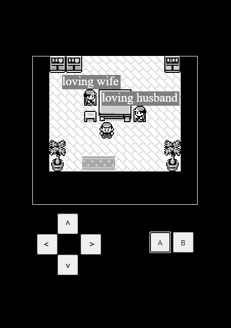

Hello, its been a long time since I've written a blog. Since then I have started and closed a company, changed jobs twice and had a mental breakdown but we are now back on track, and being back on track, what better a thing to do than get obsessed with a new project: __Creating a game engine in TypeScript and HTML5 Canvas.__

This is the first post in a series where I discuss my journey in creating my own Game Engine from scratch using nothing but TypeScript and HTML5 Canvas. I will be going in depth on various issues and random quirks I've encountered throughout my development journey and how I overcame them. This is an on going project with many more issues to solve so stay tuned for (ir)regular updates. 

## Why create my own game engine? 
This all started as an ill-fated attemped to recreate the GameBoy game Pokémon Red but as in browser MMO. While I had some success in creating a cute little game where multiple players could join and walk around, the code quickly became a mess and each additional feature became a pain to implement.

## TODO(shane): Insert video of the MMO here

That project was left to the side while I changed jobs and I never really picked it back up again, and then heroku killed their free hosting tier so I lost interest as I didn't want to set up a new hosting / deployment pipeline for testing etc.
My friends and I had some fun in it while it was working with one friend even making this very wholesome meme by logging in with multiple characters at the same time. 

I would share the other memes they made but I want to keep this blog somewhat safe for work. 

In the end I decided to abandon that project as I didn't have the time to work on it anymore. That didn't last long though, and from the ashes of that project arose the basis for my new engine. Taking everything that I had learned about HTML5 Canvas, some brief experience with Unity before they became really shit with their licensing and a short stint messing about with the s&box engine by FacePunch, I decided to create a proper engine for 2D pixel art games. So I tore apart my Pokémon MMO codebase, tossed out everything except the renderer and the update loop, and started from there.

## Why make a game using web technologies?
So you're probably asking yourself, why make a game using web technologies? This is a great question. 

I wanted to create a game from scratch with little to no dependencies. This project uses only typescript and webpack as dependencies and honestly those are only for convenience. This could have been achieved without webpack and using just Vanilla JavaScript but that would have been much more tedious. While I'm not a JavaScript purist, I hate the current situation of NPM and dependency hell. I wanted to create something as self contained as possible using just the APIs available in the browser.

- Would using an already existing game engine be easier? __Yes.__
- Would using a different language more equipped for the task such as C# or C++ have been a better idea? __Yes.__
- Would either of those have been as much fun? __No.__
- Do I care what the correct way to do things is? __No.__

This project is to have fun and learn, and to better myself as a developer. I'm not looking to create the most performant engine ever or even the most robust one. I want to create an engine that is easy to work with and easy to extend.

## Goals of this project

Just to quickly sum up the goals of this project.
- Create a game engine to allow the development 2D pixel art games in TypeScript in a simple, yet enjoyable, way.
- Enable the shipping of those games across multiple platforms without any additional configuration beyond running a script.

With such great tooling available now for web development, it will be trivial to take games created in this engine originally built for web and to package them up in custom clients to ship on Desktop, Mobile or even Console. Ofcourse, this is me getting very ahead of myself but this is the direction I see this project going. It will include the core game framework, an editor, and premade clients so you can ship on any platform without having to do any (or much) additional configuration for your game between clients.

Along side developing this engine, I am also developing my own game with it. Developing a game in the engine itself has already made me realise a massive amount of it's short comings, severeal of which I have already resolved. This tandem approach to engine and game development is allowing me to create something that might actually be useful to others too. 

## What's next?
As I continue to develop my engine and game, I will be writing some blog posts that go into detail on some topics that I have found interesting / challenging during the development journey so far. I plan on writing about the following to start with:

- Engine Structure / Game Loop
  <!-- 
  TODO: Move this into the engine structure blog post
  - Current + Planned changes
  - Scene
  - Map
  - SceneObject
  - Background
  - Game Loop
  - Render Layers -->
- Full Screen mode quirks
- HTML5 Canvas Quirks and Gotchas
 <!-- 
 - Drawing at 0.5 offset
 - Font antialiasing
 - getting rid of blur
  -->
- Writing an update loop with `requestAnimationFrame()`
<!-- Time Delta -->
- Capturing mouse, keyboard and touch events

I'll update the above list with links to the blog posts once they are written so be sure to check back to see when they're written!

## Can I see the Engine in action?
Ofcourse you can!

# TODO(shane): video of game engine in action

You can see the current progress of the engine here on GitHub 
https://github.com/shanemcgowan/typescript-game-engine

You can also checkout the sample game created entirely in the engine here (code for this game is included in the git repo) https://shanemcgowan.com/typescript-game-engine/game/dist/

Be sure to stay tuned to both as I will be updating both the engine and sample game regularly with new features / improvements.